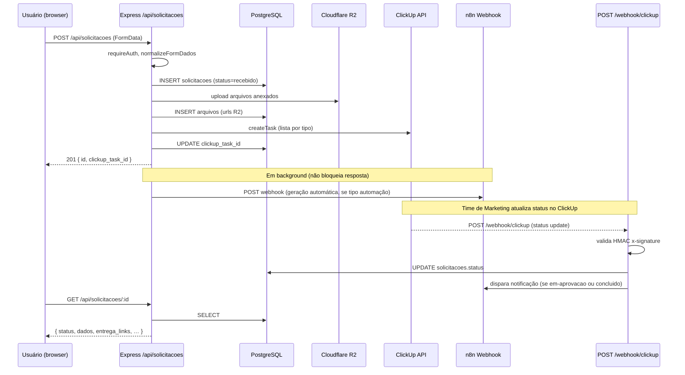

# Arquitetura

## Stack e camadas

```
┌─────────────────────────────────────────────┐
│  Navegador (HTML/CSS/JS vanilla)             │
│  auth.js · shell.js · form-core.js · etc.   │
└──────────────────┬──────────────────────────┘
                   │ HTTP (fetch)
┌──────────────────▼──────────────────────────┐
│  Express 5 (Node.js ESM / TypeScript)        │
│  src/app.ts  ←  src/routes/index.ts          │
│  ┌──────────┐ ┌────────┐ ┌────────────────┐ │
│  │ forms.ts │ │auth.ts │ │   admin.ts     │ │
│  └──────────┘ └────────┘ └────────────────┘ │
│  ┌──────────┐ ┌─────────┐ ┌─────────────┐  │
│  │clickup.ts│ │webhook  │ │  assets.ts  │  │
│  └──────────┘ └─────────┘ └─────────────┘  │
└──┬──────────────────────────────────────────┘
   │
   ├── PostgreSQL (Drizzle ORM)  — sessions, users, solicitacoes, …
   ├── Cloudflare R2              — arquivos de upload, artes geradas
   ├── ClickUp API                — cria e consulta tarefas
   ├── n8n Webhooks               — dispara automações de geração
   └── MySQL Contatos (legado)    — perfil do usuário (telefone, unidade)
```

## Fluxo de uma solicitação (Mermaid)



## Estrutura de pastas comentada

```
artifacts/api-server/
├── build.mjs                   # script de build com esbuild (ESM)
├── package.json                # dependências e scripts npm
├── tsconfig.json               # TypeScript (compilação)
├── tsconfig.typecheck.json     # TypeScript (type-check sem emit)
│
├── public/                     # arquivos estáticos servidos pelo Express
│   ├── *.html                  # páginas (uma por tela)
│   ├── auth.js                 # client de sessão/perfil
│   ├── config.js               # constantes de UI (categorias, status, labels)
│   ├── form-core.js            # engine de formulários (init/validate/submit)
│   ├── filters.js              # painéis de filtro reutilizáveis
│   ├── shell.js                # navbar/sidebar global
│   ├── utils.js                # helpers (esc, humanizeValue, masks, Modal)
│   ├── upload-feedback.js      # feedback visual em inputs de arquivo
│   ├── toast.js                # notificações não-bloqueantes e confirmações
│   └── ibge-loader.js          # estados/cidades via API IBGE (cache 24h)
│
└── src/
    ├── app.ts                  # monta o Express (middleware, rotas, erros)
    ├── index.ts                # entry-point: inicializa DB, sobe o servidor
    │
    ├── assets/                 # recursos estáticos embarcados no servidor
    │   ├── fonts/              # IvyJournal-Light.ttf, RoobertPRO-Regular.otf
    │   └── imagens/            # assets base para geração de assinaturas
    │
    ├── cartao/
    │   └── gerar-cartao.ts     # gerador de cartão físico (PDF com fontes vetorizadas)
    │
    ├── config/
    │   ├── clickup-status.ts   # mapa ClickUp status → Hub status interno
    │   ├── form-schemas.ts     # fonte única de tipos de formulário e campos
    │   └── unidades.ts         # endereços das unidades SVN
    │
    ├── lib/
    │   ├── logger.ts           # configuração do pino
    │   ├── mysqlContatos.ts    # pool MySQL para busca de perfil por email
    │   └── r2-client.ts        # singleton S3Client para o R2
    │
    ├── middleware/
    │   └── auth.middleware.ts  # requireAuth, requireRole
    │
    ├── routes/
    │   ├── index.ts            # agrega sub-routers e define prefixos
    │   ├── forms.ts            # CRUD de solicitações, /form-schemas
    │   ├── admin.ts            # usuários, tombamentos, ClickUp config
    │   ├── auth.ts             # login MSAL, callback, /me, logout
    │   ├── clickup.ts          # criação de tarefas e consultas ClickUp
    │   ├── webhook.ts          # recebe updates do ClickUp via HMAC
    │   ├── r2.ts               # upload/delete no R2
    │   ├── assets.ts           # biblioteca de assets para templates
    │   └── health.ts           # GET /healthz
    │
    ├── scripts/
    │   ├── import-cartoes.ts   # importa histórico CSV de cartões físicos
    │   ├── migrate-assignments.ts  # migra assignees do env para o banco
    │   └── seed-art-templates.ts   # semeie templates de arte padrão
    │
    ├── services/
    │   ├── activity-log.ts     # registra eventos em eventos_solicitacao
    │   ├── art-generator.ts    # orquestra geração automática de artes
    │   ├── notifications.ts    # dispara webhooks n8n nos marcos do fluxo
    │   ├── pdf-renderer.ts     # converte template para PDF via pdf-lib
    │   └── template-renderer.ts # motor de renderização de imagem via sharp
    │
    ├── types/
    │   ├── art-template.ts     # tipos do sistema de templates
    │   ├── express.d.ts        # extensão de tipos do Express (session.user)
    │   └── vendor-shims.d.ts   # shims de módulos sem @types
    │
    └── utils/
        └── api-error.ts        # classe ApiError com factories estáticas
```
